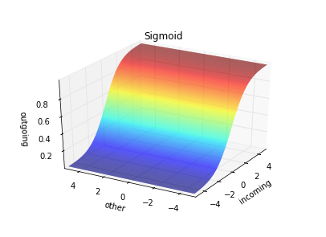

[![Build Status][1]][2]
[![Code Climate][3]][4]
[![PyPI Downloads][5]][6]
[![Documentation][7]][8]

[1]: https://travis-ci.org/danijar/layered.svg?branch=master
[2]: https://travis-ci.org/danijar/layered
[3]: https://codeclimate.com/github/danijar/layered/badges/gpa.svg
[4]: https://codeclimate.com/github/danijar/layered
[5]: https://img.shields.io/pypi/dw/layered.svg
[6]: pypi.python.org/pypi/layered
[7]: https://readthedocs.org/projects/pip/badge/
[8]: http://layered.readthedocs.org/en/latest/

Layered
=======

This project is aims to be a clean reference implementation of feed forward
neural networks. It's written in Python 3 published under the MIT license. I
started this project as part of my efforts to understand the concepts of deep
learning.

You can use this repository as guidance if you want to implement neural
networks what I highly recommend if you are interested in understanding them.
It's a good way to build intuition and allows you to verify your understanding.
For example, I had a small misunderstanding of the backpropagation formula. My
network still trained but I found the mistake by numerical gradient checking.

Instructions
------------

Optionally, create a virtual environment and install Layered. You can safely
ignore *"Failed building wheel"* messages. Then run it on an example problem.
This will train a network with 1.3M weights to classify handwritten digits
visualize progress. After a couple of minutes, the error should drop below 3%.

```bash
virtualenv . -p python3 && source bin/activate
pip install layered
curl -o mnist.yaml -L http://git.io/vBPOH
layered mnist.yaml -v
```

### Problem Definition

Learning problems are defined in YAML files and it's easy to define your own.
This is how the example problem from above looks like. An overview of available
cost and activation functions is available a few sections below.

```yaml
dataset: Mnist
cost: CrossEntropy
layers:
  - activation: Linear
    size: 784
  - activation: Relu
    size: 700
  - activation: Relu
    size: 700
  - activation: Relu
    size: 400
  - activation: Softmax
    size: 10
epochs: 5
batch_size: 32
learning_rate: 0.01
momentum: 0.9
weight_scale: 0.01
weight_decay: 0
evaluate_every: 5000
```

### Command Line Arguments

```
layered [-h] [-v] [-l weights.npy] [-s weights.npy] problem.yaml
```

| Short | Long | Description |
| :---- | :--- | :---------- |
| `-h` | `--help` | Print usage instructions |
| `-v` | `--visual` | Show a diagram of trainig costs and testing error |
| `-l` | `--load` | Path to load learned weights from at startup |
| `-s` | `--save` | Path to dump the learned weights at each evaluation |

### Contribution

Optionally, create a virtual environment. Then install the dependencies.

```bash
git clone git@github.com:danijar/layered.git && cd layered
virtualenv . -p python3 && source bin/activate
pip install -e .
```

See if everything's working.

```bash
python -m layered problem/modulo.yaml -v
```

Now you can start playing around with the code. For pull requests, please
squash the changes to a single commit and ensure that the linters and tests are
passing.

```bash
python setup.py test
```

If you have questions, feel free to contact me.

Manual Guide
------------

In this guide you will learn how to create and train models manually rather
than using the problem definitions to gain more insight into training neural
networks. Let's start!

### Network Definition

A network is defined by its layers. The parameters for a layer are the amount
of neurons and the activation function. The first layer has a linear activation
since we don't want to apply any function to the input data.

```python
from layered.network import Network
from layered.activation import Linear, Relu, Softmax

num_inputs = 784
num_outputs = 10

network = Network([
    Layer(num_inputs, Linear),
    Layer(700, Relu),
    Layer(500, Relu),
    Layer(300, Relu),
    Layer(num_outputs, Softmax),
])
```

### Activation Functions

| Function | Definition | Graph |
| -------- | :--------: | ----- |
| Linear | x |  |
| Relu | max(0, x) |  |
| Sigmoid | 1 / (1 + exp(-x)) |  |
| Softmax | exp(x) / sum(exp(x)) |  |

### Weight Initialization

The weight matrices of the network are handed to algorithms like
backpropagation, gradient decent and weight decay.

If the initial weights of a neural network would be zero, no activation would
be passed to the deeper layers. So we start with random values sampled from a
normal distribution.

```python
from layered.network import Matrices

weights = Matrices(network.shapes)
weights.flat = np.random.normal(0, weight_scale, len(weights.flat))
```

### Optimization Algorithm

Now let's learn good weights with standard backpropagation and gradient decent.
The classes for this can be imported from the `gradient` and `optimization`
modules. We also need a cost function.

```python
from layered.cost import Squared
from layered.gradient import Backprop
from layered.optimization import GradientDecent

backprop = Backprop(network, cost=Squared())
decent = GradientDecent()
```

### Cost Functions

| Function | Definition | Graph |
| -------- | :--------: | ----- |
| Squared | (pred - target) ^ 2 / 2 |  |
| CrossEntropy | -((target * log(pred)) + (1 - target) * log(1 - pred)) |  |

### Dataset and Training

Datasets are automatically downloaded and cached. We just iterate over the
training examples and train the weights on them.

```python
from layered.dataset import Mnist

dataset = Mnist()
for example dataset.training:
    gradient = backprop(network, cost)
    weights = decent(weights, gradient, learning_rate=0.1)
```

### Evaluation

Finally, we want to see what our network has learned. We do this by letting the
network predict classes for the testing examples. The strongest class is the
model's best bet, thus the `np.argmax`.

```python
import numpy as np

error = 0
for example in dataset.testing:
    prediction = network.feed(weights, example.data)
    if np.argmax(prediction) != np.argmax(example.target):
        error += 1 / len(dataset.testing)
print('Testing error', round(100 * error, 2), '%')
```

Please don't hestitate to send feedback and ideas to me at mail@danijar.com and
open issues if something's not working.
