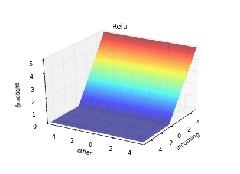
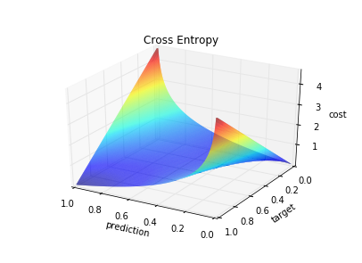

[![Build Status][1]][2]
[![Code Climate][3]][4]

[1]: https://travis-ci.org/danijar/layered.svg
[2]: https://travis-ci.org/danijar/layered
[3]: https://codeclimate.com/github/danijar/layered/badges/gpa.svg
[4]: https://codeclimate.com/github/danijar/layered

Layered Neural Network
======================

This project is aims to be a clean reference implementation of feed forward
neural networks in Python 3 under the MIT license. It's part of my efforts to
understand the concepts of deep learning.

You can use this repository when doing your own implementation of neural
networks what I highly recommend if you are interested in understanding them.
It's a good way to build intuition and allows you to verify your understanding.
For example, I had a small misunderstanding of the backpropagation formula. My
network still trained but I found the mistake by numerical gradient checking.

Instructions
------------

If you have Matplotlib for Python 3 installed on your machine, download the
MNIST dataset into `dataset/mnist/` and run this command. It will start
training a network to classify handwritten digits.

```bash
python3 main.py problem/example.yaml
```

Learning problems are defined in YAML. This is how the example file looks like.

```yaml
dataset: Mnist
cost: Squared
layers:
  - size: 784
    activation: Linear
  - size: 700
    activation: Relu
  - size: 500
    activation: Relu
  - size: 300
    activation: Relu
  - size: 10
    activation: Sigmoid
training_rounds: 5
batch_size: 10
learning_rate: 0.25
momentum: 0.3
weight_scale: 0.01
weight_decay: 1e-3
evaluate_every: 5000
```

Quick Start
-----------

### Network Definition

In this guide you will learn how to create and train models manually. A network
is defined by it's layers. The parameters for a layer are the amount of neurons
and the activation function. The first layer has a linear activation since the
input data shouldn't be transformed directly.

```python
from layered.network import Network
from layered.activation import Linear, Relu, Sigmoid

network = Network([
    Layer(num_inputs, Linear),
    Layer(700, Relu),
    Layer(500, Relu),
    Layer(300, Relu),
    Layer(num_outputs, Sigmoid)
])
```
### Activation Functions

| Function | Definition | Graph |
| -------- | :--------: | ----- |
| Linear | x |  |
| Sigmoid | 1 / (1 + exp(-x)) |  |
| Relu | max(0, x) |  |
| Softmax | exp(x) / sum(exp(x)) |  |

### Weight Initialization

The weight matrices of the network are handed to algorithms like
backpropagation, gradient decent and weight decay.

If the initial weights of a neural network would be zero, no activation would
be passed to the deeper layers. So we start with random values of a normal
distribution.

```python
from layered.network import Matrices

weights = Matrices(network.shapes)
weights.flat = np.random.normal(0, weight_scale, len(weights.flat))
```

### Optimization Methods

Not let's learn good weights with backpropagation and gradient decent.  The
classes for this can be imported from the `gradient` and `optimization`
modules. We also need to decide for a cost function.

```python
from layered.cost import Squared
from layered.gradient import Backprop
from layered.optimization import GradientDecent

backprop = ParallelBackprop(network, cost=Squared())
decent = GradientDecent()
```

### Gradient Algorithms

- Backprop
- BatchBackprop
- ParallelBackprop
- NumericalGradient
- CheckedBackprop

### Cost Functions

| Function | Definition | Graph |
| -------- | :--------: | ----- |
| Squared | (pred - target) ^ 2 / 2 |  |
| CrossEntropy | -((target * log(pred)) + (1 - target) * log(1 - pred)) |  |

### Dataset and Training

Download the four files of the MNIST dataset from Yan LeCun's website.

```python
from layered.dataset import Mnist

dataset = Mnist('dataset/mnist')
for example dataset.training:
    gradient = backprop(network, cost)
    weights = decent(weights, gradient, learning_rate=0.1)
```

### Evaluation

Then evaluate the learned weights on the testing examples.

```python
import numpy as np
from layered.utility import averaged

error = averaged(examples, lambda x:
    float(np.argmax(x.target) !=
    np.argmax(network.feed(weights, x.data))))
print('Testing error', round(100 * error), '%')
```

Contribution
------------

Feel free to file pull requests. If you have questions, you can ask me.
