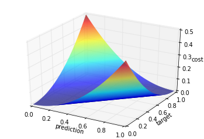

[![Code Climate][1]][2]

[1]: https://codeclimate.com/github/danijar/neural-network/badges/gpa.svg
[2]: https://codeclimate.com/github/danijar/neural-network

Layered Neural Network
======================

This project is aims to be a clean reference implementation of feed forward
neural networks in Python 3 under the MIT license. It's part of my efforts to
understand the concepts of deep learning.

You can use this repository when doing your own implementation of neural
networks which I highly recommend if you are interested in understanding them.
It makes sure you correctly understand all the details. For example, I had a
small misunderstanding of the backpropagation formula. My network still trained
but I found the mistake by numerical gradient checking.

Instructions
------------

If you have Numpy and Matplotlib for Python 3 installed on your machine, you
can just run this command. To tweak parameters of the networks like changing
activation functions or number of layers just edit this file.

```bash
python3 main.py
```

Features
--------

This repository provides implementations for a layered neural network,
activation functions, cost functions and different optimization algorithms. All
those are implemented in an object-oriented design so that alternatives can be
added easily. There are also two generated toy problems for the networks to
learn.

### Activation functions

| Function | Definition | Graph |
| -------- | :--------: | ----- |
| Linear | x |  |
| Sigmoid or logistic | 1 / (1 + exp(-x)) |  |
| Relu | max(0, x) |  |

### Cost functions

| Function | Definition | Graph |
| -------- | :--------: | ----- |
| Squared | (prediction - target) ^ 2 / 2 |  |
| Cross Entropy | -((target * log(prediction)) + (1 - target) * log(1 - prediction)) |  |

### Optimization algorithms

- Stochastic gradient decent
- Batch gradient decent
- Mini batch gradient decent

### Gradient algorithms

- Backpropagation
- Numerical gradient
- Checked gradient

Contribution
------------

Feel free to file pull requests. If you have questions, you can ask me.
