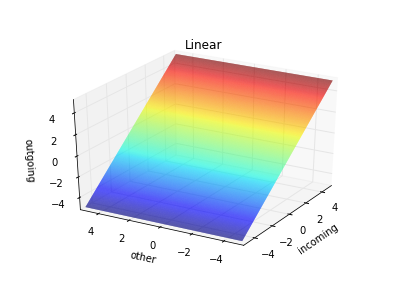

[![Build Status][1]][2]
[![Code Climate][3]][4]

[1]: https://travis-ci.org/danijar/layered.svg?branch=master
[2]: https://travis-ci.org/danijar/layered
[3]: https://codeclimate.com/github/danijar/layered/badges/gpa.svg
[4]: https://codeclimate.com/github/danijar/layered

Layered Neural Network
======================

This project is aims to be a clean reference implementation of feed forward
neural networks. It's written in Python 3 published under the MIT license. I
started this project as part of my efforts to understand the concepts of deep
learning.

You can use this repository as guidance if you want to implement neural
networks what I highly recommend if you are interested in understanding them.
It's a good way to build intuition and allows you to verify your understanding.
For example, I had a small misunderstanding of the backpropagation formula. My
network still trained but I found the mistake by numerical gradient checking.

Instructions
------------

Optionally, create a virtual environment. Then install the dependencies. If you
encounter errors, try installing `python3-matplotlib` or equivalent via your
platform's package manager.

```bash
virtualenv . -p python3 && source bin/activate
pip install -r requirement/core.txt
pip install -r requirement/user.txt
```

This will start training a network to classify handwritten digits and regularly
print evaluation results on the test examples. After a few minutes, the error
should drop below 3%.

```bash
python main.py problem/mnist-batch.yaml -v
```

Problem Definition
------------------

Learning problems are defined in YAML files and it's easy to define your own.
This is how the example problem above looks like.

```yaml
dataset: Mnist
cost: CrossEntropy
layers:
  - activation: Linear
    size: 784
  - activation: Relu
    size: 700
  - activation: Relu
    size: 700
  - activation: Relu
    size: 400
  - activation: Softmax
    size: 10
training_rounds: 5
batch_size: 32
learning_rate: 0.01
momentum: 0.9
weight_scale: 0.1
weight_decay: 0
evaluate_every: 5000
```

Manual Guide
------------

In this guide you will learn how to create and train models manually rather
than using the problem definitions. You will gain more insight into training
neural networks and how thie library works. It's easy so let's get started!

### Network Definition

A network is defined by it's layers. The parameters for a layer are the amount
of neurons and the activation function. The first layer has a linear activation
since we don't want to apply any function to the input data. The sizes of the
input and output layers must match the data and label sizes of the dataset.

```python
from layered.network import Network
from layered.activation import Linear, Relu, Sigmoid

network = Network([
    Layer(784, Linear),
    Layer(700, Relu),
    Layer(500, Relu),
    Layer(300, Relu),
    Layer(10, Sigmoid),
])
```
### Activation Functions

| Function | Definition | Graph |
| -------- | :--------: | ----- |
| Linear | x |  |
| Sigmoid | 1 / (1 + exp(-x)) |  |
| Relu | max(0, x) |  |
| Softmax | exp(x) / sum(exp(x)) |  |

### Weight Initialization

The weight matrices of the network are handed to algorithms like
backpropagation, gradient decent and weight decay.

If the initial weights of a neural network would be zero, no activation would
be passed to the deeper layers. So we start with random values sampled from a
normal distribution.

```python
from layered.network import Matrices

weights = Matrices(network.shapes)
weights.flat = np.random.normal(0, weight_scale, len(weights.flat))
```

### Optimization Algorithm

Now let's learn good weights with standard backpropagation and gradient decent.
The classes for this can be imported from the `gradient` and `optimization`
modules. We also need a cost function.

```python
from layered.cost import Squared
from layered.gradient import Backprop
from layered.optimization import GradientDecent

backprop = Backprop(network, cost=Squared())
decent = GradientDecent()
```

### Cost Functions

| Function | Definition | Graph |
| -------- | :--------: | ----- |
| Squared | (pred - target) ^ 2 / 2 |  |
| CrossEntropy | -((target * log(pred)) + (1 - target) * log(1 - pred)) |  |

### Dataset and Training

Downloading and caching datasets is automated for you. So we just iterate over
the training examples and train on them.

```python
from layered.dataset import Mnist

dataset = Mnist()
for example dataset.training:
    gradient = backprop(network, cost)
    weights = decent(weights, gradient, learning_rate=0.1)
```

### Evaluation

Finally, we want to see what you network has learned. We do this by letting the
network predict classes for the testing examples. The highest probability is
the model's best bet, thus the `np.argmax`.

```python
import numpy as np
from layered.utility import averaged

error = averaged(
    examples, lambda x:
    float(np.argmax(x.target) !=
          np.argmax(network.feed(weights, x.data))))
print('Testing error', round(100 * error), '%')
```

Contribution
------------

You are welcome to add new learning methods and other improvements to the
library. Please check if the linters and tests are passing.

```bash
pip install -r requirement/test.txt
python setup.py test
```

If you have questions, feel free to contact me.
